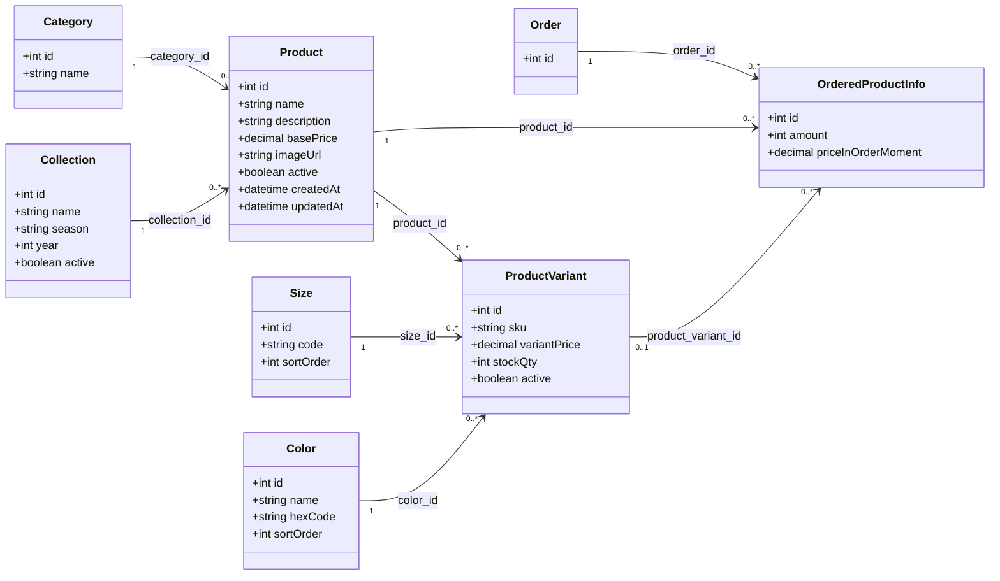

## Architektur

### System-Architektur

```txt
┌─────────────────────────────────────────────────┐
│                  Client Layer                    │
│              (Next.js 16 Frontend)               │
│        React Components + Tailwind CSS 4         │
└─────────────────────────────────────────────────┘
                       │
                       │ HTTP/REST
                       ▼
┌─────────────────────────────────────────────────┐
│              API Gateway Layer                   │
│           (Next.js API Routes)                   │
└─────────────────────────────────────────────────┘
                       │
                       │ REST API
                       ▼
┌─────────────────────────────────────────────────┐
│             Backend Layer                        │
│          (Spring Boot REST API)                  │
│   ┌─────────────────────────────────────┐       │
│   │     Controller Layer                │       │
│   └─────────────────────────────────────┘       │
│   ┌─────────────────────────────────────┐       │
│   │     Service Layer                   │       │
│   └─────────────────────────────────────┘       │
│   ┌─────────────────────────────────────┐       │
│   │     Repository Layer (JPA)          │       │
│   └─────────────────────────────────────┘       │
└─────────────────────────────────────────────────┘
                       │
                       ▼
┌─────────────────────────────────────────────────┐
│              Database Layer                      │
│              (PostgreSQL)                        │
└─────────────────────────────────────────────────┘
```

### Domain-Modell (UML)

Das folgende UML-Diagramm beschreibt das geplante E-Commerce-Datenmodell fuer filterbare Produkte (Groesse, Farbe, Preis, Kollektion) und die Beziehung zu Bestellungen.



Kurzdefinition:

- **Product**: Stammdaten eines Artikels (Name, Beschreibung, Kategorie, Basispreis, Bild).
- **ProductVariant**: Kaufbare Variante eines Produkts (z. B. Groesse/Farbe), inklusive SKU, Bestand und optionalem Variantenpreis.

### Frontend-Architektur (Next.js 16)

```txt
frontend/
├── app/                        # Next.js App Router
│   ├── (auth)/                 # Authentication routes
│   │   ├── login/
│   │   └── register/
│   ├── products/               # Product pages
│   │   ├── page.tsx            # Product list
│   │   └── [id]/               # Product detail
│   ├── orders/                 # Order management
│   ├── profile/                # User profile
│   ├── globals.css             # Global styles + Tailwind CSS 4 theme config
│   ├── layout.tsx              # Root layout
│   └── page.tsx                # Home page
├── components/                 # React components
│   ├── ui/                     # Reusable UI components
│   ├── forms/                  # Form components
│   └── layouts/                # Layout components
├── lib/                        # Utility functions
│   ├── api/                    # API client functions
│   └── utils/                  # Helper functions
├── hooks/                      # Custom React hooks
├── types/                      # TypeScript types
├── public/                     # Static assets
├── Dockerfile                  # Frontend development container
├── docker-compose.yml          # Docker Compose setup for local development
├── postcss.config.mjs          # PostCSS config for Tailwind CSS 4
├── next.config.ts              # Next.js configuration
└── package.json                # Frontend dependencies and scripts
```

### Styling-Architektur

Das Frontend verwendet **Tailwind CSS 4**. Die Tailwind-Konfiguration wird nicht mehr über eine klassische `tailwind.config.js` Datei gepflegt, sondern direkt in `app/globals.css` über `@import "tailwindcss"` und `@theme`.

Beispiel:

```css
@import "tailwindcss";

@theme {
  --font-sans: "Montserrat", Arial, sans-serif;

  --color-brand-black: #111111;
  --color-brand-white: #f7f7f5;
  --color-brand-gray: #d9d9d9;
  --color-brand-text: #6e6e6e;
  --color-brand-green: #3fae5a;
}
```

### Containerisierung

Das Frontend besitzt eine eigene Docker-Entwicklungsumgebung.

```txt
frontend/
├── Dockerfile
├── docker-compose.yml
└── .dockerignore
```

Der Container startet die Next.js Development-Umgebung mit:

```bash
npm run dev
```

Lokale Dateien werden in den Container gemountet, damit Fast Refresh / Hot Reloading während der Entwicklung funktioniert.

Startbefehl:

```bash
docker compose up --build
```

Die Anwendung ist danach erreichbar unter:

```txt
http://localhost:3000
```

### Komponenten-Hierarchie

- **Page Components**: Route-spezifische Seiten im `app/` Verzeichnis
- **Layout Components**: Wiederverwendbare Layouts wie Header, Footer und Sidebar
- **Feature Components**: Geschäftslogik-spezifische Komponenten, zum Beispiel Produktlisten oder Bestellübersichten
- **UI Components**: Atomare, wiederverwendbare Komponenten wie Buttons, Cards und Inputs

---
