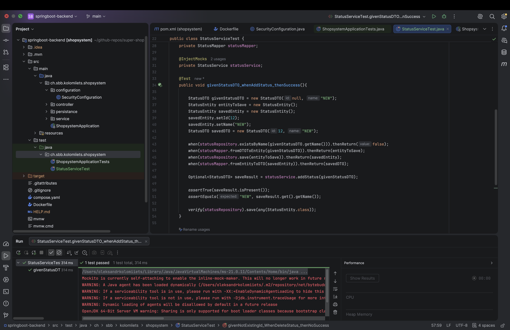
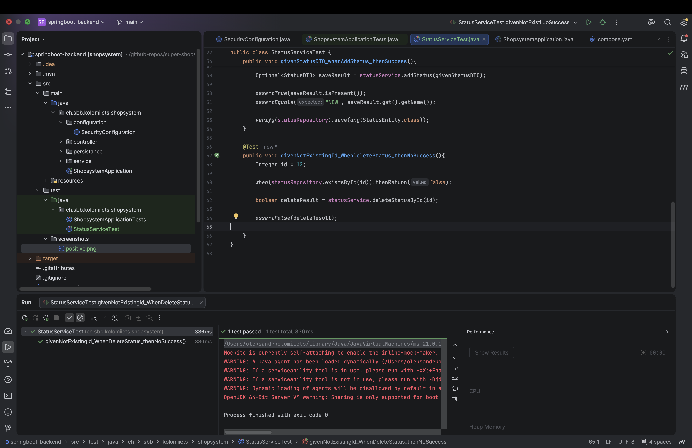

# Backend Testfälle

## Positivtest: Status erfolgreich hinzufügen

### Ziel
Überprüfen, ob ein neuer Status (z. B. "NEW") über den StatusService erfolgreich validiert, gemappt und in der Datenbank gespeichert werden kann.

### Voraussetzung
- Der eingegebene Statusname existiert noch nicht in der Datenbank (`existsByName` liefert `false`).
- Die Services und Repositories sind korrekt initialisiert (Mockito Mocks).

### Testschritte
1. Erstellen eines `StatusDTO` mit dem Namen `"NEW"`.
2. Aufruf der Methode `statusService.addStatus(givenStatusDTO)`.
3. Überprüfung der internen Mock-Interaktionen (`statusRepository.save`).

### Erwartetes Ergebnis
- Die Methode gibt ein `Optional<StatusDTO>` zurück, das nicht leer ist (`isPresent() == true`).
- Der Name des zurückgegebenen Status entspricht `"NEW"`.
- Die ID des gespeicherten Objekts wurde erfolgreich gesetzt (z. B. `12`).
- Die Methode `save()` des Repositories wurde genau einmal aufgerufen.

### Nachweis

---

## Negativtest: Löschen eines nicht existierenden Status

### Ziel
Überprüfen, ob das System korrekt reagiert und das Löschen ablehnt, wenn versucht wird, einen Status mit einer ID zu löschen, die nicht existiert.

### Voraussetzung
- Die gesuchte Status-ID (z. B. `12`) ist nicht in der Datenbank vorhanden (`existsById` liefert `false`).

### Testschritte
1. Definition einer nicht existierenden ID (`Integer id = 12`).
2. Aufruf der Methode `statusService.deleteStatusById(id)`.
3. Verifizierung, dass keine Löschinteraktion mit der Datenbank stattfindet.

### Erwartetes Ergebnis
- Die Methode gibt `false` zurück, da der Status nicht existiert.
- Es wird **keine** Exception geworfen, die das System abstürzen lässt.
- Die Methode `deleteById()` des Repositories wird **nicht** aufgerufen, da die Vorabprüfung fehlschlägt.

### Nachweis
