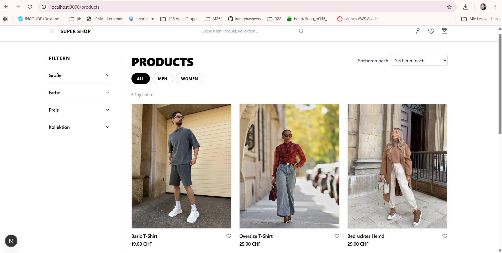
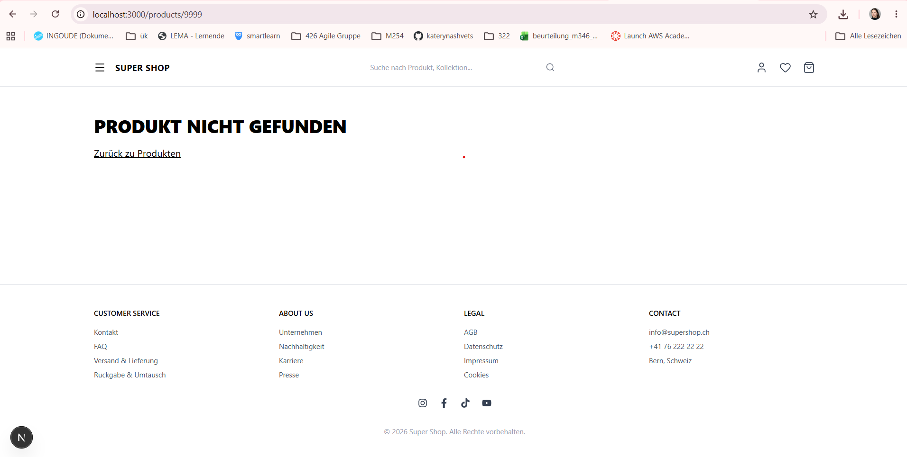

# Frontend Testfälle

## Positivtest: Produktdetailseite öffnen

### Ziel
Überprüfen, ob ein Benutzer von der Produktübersicht auf die Produktdetailseite navigieren kann.

### Voraussetzung
- Die Produktübersicht ist erreichbar.
- Mindestens ein Produkt wird angezeigt.

### Testschritte
1. Produktübersicht öffnen (`/products`).
2. Auf ein Produkt klicken.

### Erwartetes Ergebnis
- Die Produktdetailseite wird geöffnet.
- Produktname wird angezeigt.
- Produktpreis wird angezeigt.
- Produktbilder werden angezeigt.

### Nachweis

---

## Negativtest: Ungültige Produktdetailseite

### Ziel
Überprüfen, ob eine ungültige Produkt-ID korrekt behandelt wird.

### Testschritte
1. Ungültige Produktseite öffnen: `/products/9999`

### Erwartetes Ergebnis
- Seite zeigt "Produkt nicht gefunden".
- Link "Zurück zu Produkten" ist sichtbar.
- Es entsteht kein 404-Fehler und keine App-Fehlermeldung.

### Nachweis

